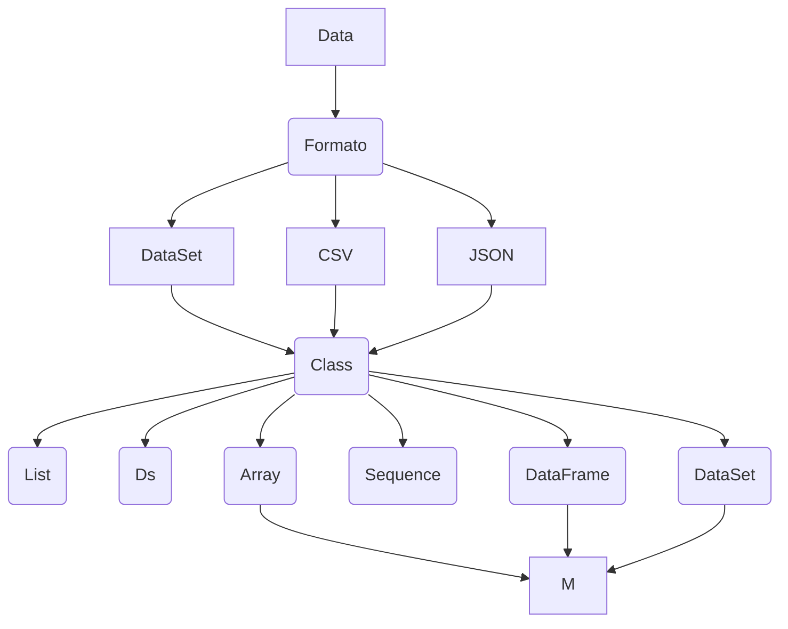

## Data

```mermaid
graph TD
A[Data] -->B(Formato)
F(Class)
    B --> C[DataSet]-->F
    B --> D[CSV]-->F
    B --> E[JSON]-->F
        F --> G(List)
        F --> H(Ds)
        F --> I(Array)--> M
        F --> J(Sequence)
        F --> K(DataFrame)--> M
        F --> L(DataSet)--> M

class A,B,C,D,E,F,G,H,I,J,K,L,M,N,O,P,Q,R,S,T,U,V,W,X,Y,Z internal-link;
```
