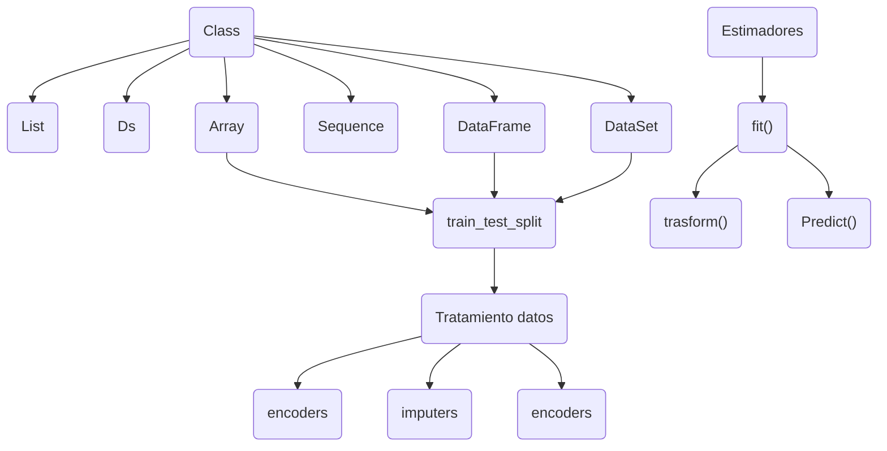

```mermaid
graph TD
F(Class)
        F --> G(List)
        F --> H(Ds)
        F --> I(Array)--> M
        F --> J(Sequence)
        F --> K(DataFrame)--> M
        F --> L(DataSet)--> M
            M(train_test_split)
            M -->N(Tratamiento datos)
            N -->O(encoders)
            N -->P(imputers)
            N -->Q(encoders)

            AA(Estimadores) -->AB("fit()")
               AB --> AC("trasform()")
               AB --> AD("Predict()")


class A,B,C,D,E,F,G,H,I,J,K,L,M,N,O,P,Q,R,S,T,U,V,W,X,Y,Z internal-link;
```
