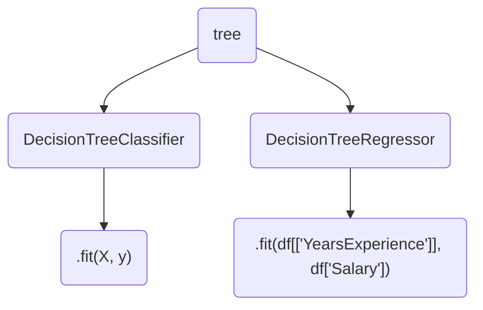

## Models-Tree

```mermaid
graph TD
                U(tree)
                   U--> AA(DecisionTreeClassifier)
                        AA-->AC(".fit(X, y)")
                   U--> AB(DecisionTreeRegressor)
                        AB-->AD(".fit(df[['YearsExperience']], df['Salary'])")

class A,B,C,D,E,F,G,H,I,J,K,L,M,N,O,P,Q,R,S,T,U,V,W,X,Y,Z internal-link;
```
