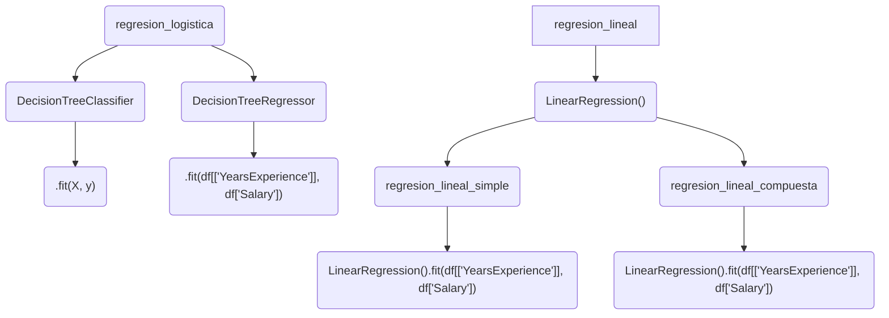

```mermaid
graph TD
                U(regresion_logistica)
                   U--> AA(DecisionTreeClassifier)
                        AA-->AC(".fit(X, y)")
                   U--> AB(DecisionTreeRegressor)
                        AB-->AD(".fit(df[['YearsExperience']], df['Salary'])")
                V[regresion_lineal]
                V --> AE("LinearRegression()")
                    AE --> W(regresion_lineal_simple)
                        W-->AF("LinearRegression().fit(df[['YearsExperience']], df['Salary'])")
                    AE --> X(regresion_lineal_compuesta)
                        X-->AG("LinearRegression().fit(df[['YearsExperience']], df['Salary'])")


class A,B,C,D,E,F,G,H,I,J,K,L,M,N,O,P,Q,R,S,T,U,V,W,X,Y,Z internal-link;
```
